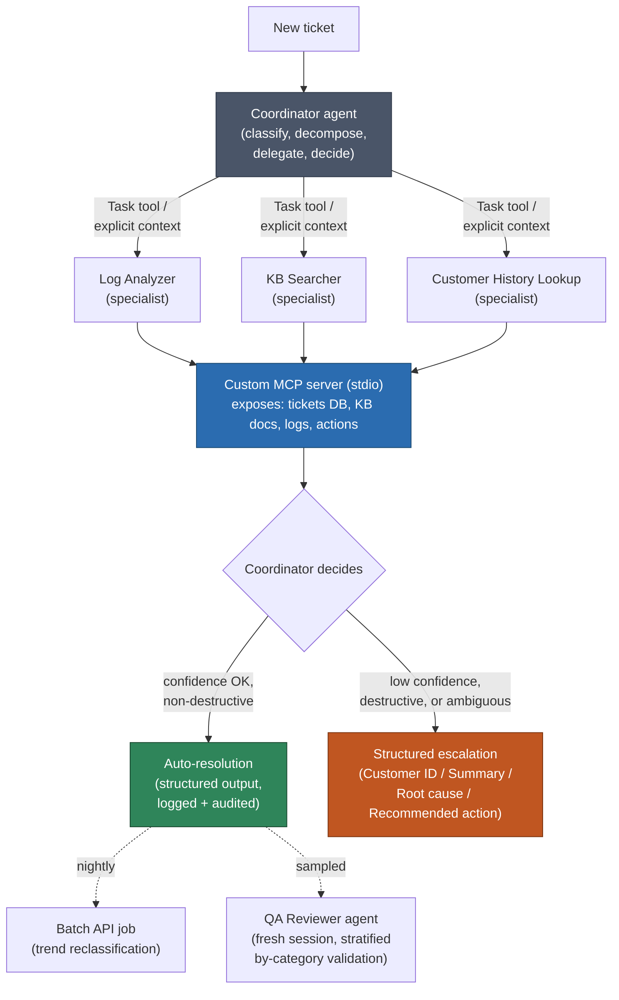

# Incident Copilot — a demo project covering the full Claude Certified Architect curriculum

## Why this project

Your guide's curriculum has 5 domains and 30 task statements (1.1–5.6). Most demo projects only exercise 2–3 of them — a simple chatbot touches prompt engineering but nothing about orchestration or MCP; a tool-calling wrapper touches tool design but nothing about context management. This spec is built the other way around: it starts from your 30 task statements and works backward to a single system where every one of them is a real, necessary piece — not a bolted-on exercise.

**The premise:** a fake SaaS company's support/incident queue. Tickets come in (billing questions, bug reports, production incidents, "the app is slow"). An agentic system triages them, investigates using scoped tools, either resolves or escalates with a structured handoff, and is auditable, resumable, and safe by construction (not by prompt hope).

Everything is synthetic — SQLite for customers/tickets, JSON files for a "runbook" knowledge base and log dumps. No real integrations required, so there's no cost/access barrier to starting. It's designed to be built *with* Claude Code, which means the act of building it also gives you reps on Domain 3 (CLAUDE.md, skills, hooks, CI) as a side effect of normal development, not as a separate exercise.

## Architecture at a glance

Nightly: a **Batch API** job re-classifies the day's resolved tickets for trend reporting. Separately, a **QA Reviewer** agent (fresh session, never the session that resolved the ticket) audits a sample using stratified-by-category validation.

## Suggested stack

- **Language:** Python throughout (Anthropic SDK + Claude Agent SDK for agents; `mcp` Python SDK for the server) — one language keeps this a weekend-scale project, not an infra project.
- **Storage:** SQLite (`tickets`, `customers`, `resolutions` tables) + a `runbooks/` folder of markdown "KB articles" (deliberately include two that mildly contradict each other, with different dates — you'll need this for 5.6) + a `logs/` folder of synthetic log snippets.
- **Dev environment:** Claude Code, with a real `.claude/` config (this is graded material, not scaffolding).
- **CI:** GitHub Actions running Claude Code headlessly.

## Skill map: every task statement → a concrete piece of the build

### Domain 1 — Agentic Architecture & Orchestration (27%)

| # | Task statement | Where it lives in the project |
|---|---|---|
| 1.1 | Agentic Loops | Hand-roll the Coordinator's core loop directly against the Messages API for at least one agent: inspect `stop_reason`, append tool results before the next call, terminate only on `end_turn`. Add an iteration cap but wire it as a safety net, not the stopping condition — log if it ever fires, since that means 1.1 was violated somewhere. |
| 1.2 | Multi-Agent Orchestration | Implement three patterns on purpose, not by accident: **Hub-and-spoke** (Coordinator → specialists) as the default; **Parallel** fan-out when Log Analyzer and KB Searcher have no dependency on each other; **Sequential** for the classify → investigate → draft-resolution pipeline. |
| 1.3 | Subagent Invocation & Context Passing | Use Agent SDK `AgentDefinition`s for each specialist, capped at 4–5 tools each. Pass ticket context explicitly through the task payload — no shared conversation history between Coordinator and specialists. |
| 1.4 | Workflow Enforcement & Handoff | Define the escalation payload schema (Customer ID, Summary, Root cause, Recommended action) once and enforce it everywhere. Add a `PreToolUse` hook that blocks a simulated `issue_refund` tool above a $50 threshold regardless of what the model decides. |
| 1.5 | Agent SDK Hooks | `PreToolUse` hook blocking destructive actions (e.g. `delete_customer_record`, large refunds). `PostToolUse` hook writing every tool call to an append-only audit log — this becomes your evidence trail for 5.5 later. |
| 1.6 | Task Decomposition | Fixed decomposition for known categories ("billing" always: look up invoice → check payment status). Dynamic, model-decided decomposition for anything that doesn't match a known category. |
| 1.7 | Session State & Resumption | Use Claude Code's `-c`/`-r` (or SDK session persistence) so a paused investigation resumes correctly. Implement `fork_session` for a "what if we tried a different fix" exploration that doesn't pollute the main investigation thread. |

### Domain 2 — Tool Design & MCP Integration (18%)

| # | Task statement | Where it lives |
|---|---|---|
| 2.1 | Tool Interface Design | Write full descriptions for `search_knowledge_base`, `get_customer_history`, `get_recent_logs`, `create_refund` — what it does, input constraints, return shape, boundaries, example trigger queries. Descriptive param names (`customer_email`, not `email`), enums for ticket category/severity. |
| 2.2 | Structured Error Responses | Every tool returns `{errorCategory, isRetryable, retryAfterMs, partialResult, suggestion}` on failure — never a bare string. Deliberately test both cases: KB search returning 0 results (valid empty, accept it) vs. simulated DB-down (access failure, retry/escalate). |
| 2.3 | Tool Distribution & Tool Choice | `tool_choice: auto` for the Coordinator's open-ended loop. Forced `tool_choice: {type: "tool", name: "classify_ticket"}` for the classification step, where you need guaranteed structured output every time. |
| 2.4 | MCP Server Integration | Build a real custom MCP server exposing the ticket DB, KB, and logs over stdio, wired in via project-level `.mcp.json`. As a comparison exercise, also wire in one community MCP server (filesystem or fetch) and note in your README why you didn't need to build that one yourself. |
| 2.5 | Built-in Tools | While building the system itself in Claude Code, be deliberate about Grep vs. Glob vs. Read vs. Bash — this is dogfooding, not a separate task, but worth noting in your dev log which tool Claude Code reached for and whether it was the right call. |

### Domain 3 — Claude Code Configuration & Workflows (20%)

| # | Task statement | Where it lives |
|---|---|---|
| 3.1 | CLAUDE.md Hierarchy | Root `CLAUDE.md` (architecture overview, conventions). Nested `CLAUDE.md` inside `mcp-server/` with protocol-specific rules. Your own `~/.claude/CLAUDE.md` preferences layered on top. |
| 3.2 | Slash Commands & Skills | A skill `triage-ticket` (`context: fork`, `allowed-tools` restricted to what triage needs) that runs the full flow end-to-end. Slash commands like `/new-ticket $ARGUMENTS` and `/replay-incident <id>`. |
| 3.3 | Path-Specific Rules | `.claude/rules/` entries scoped by `paths`: one for `mcp-server/**` (protocol/error-handling conventions), one for `agents/**` (prompt/persona conventions) — they shouldn't leak into each other. |
| 3.4 | Plan Mode vs Direct Execution | Use plan mode deliberately when first designing the orchestration engine (complex, several valid approaches). Direct execution for small, well-scoped fixes later. Note the difference in your dev log. |
| 3.5 | Iterative Refinement | Practice giving concrete before/after code examples rather than prose feedback. Batch independent fixes in one message; sequence dependent ones. Review Claude Code's own generated orchestration code in a **fresh session**, not the one that wrote it. |
| 3.6 | CI/CD Integration | A GitHub Actions job running `claude -p "review this PR diff for tool-schema and hook-safety issues" --output-format json --json-schema '<review-schema>'` as an automated check, with `--append-system-prompt` injecting repo-specific review criteria. |

### Domain 4 — Prompt Engineering & Structured Output (20%)

| # | Task statement | Where it lives |
|---|---|---|
| 4.1 | System Prompts with Explicit Criteria | Coordinator's system prompt: role/context → rules/constraints → output format → 2–3 calibration examples distinguishing a P1 incident from a P3 one. |
| 4.2 | Few-Shot Prompting | 2–4 examples for ticket classification, each with stated reasoning, including one deliberately ambiguous edge case. |
| 4.3 | Structured Output with Tool Use | `classify_ticket` tool forced via `tool_choice`, with `category` as an enum and low-confidence fields marked `nullable` so the model can say "unknown" instead of fabricating. |
| 4.4 | Validation, Retry, and Feedback Loops | If a fix-suggestion fails schema validation, retry with `original + failed output + specific error` (never just "try again"). Escalate to a human after 2 failed retries. |
| 4.5 | Batch Processing Strategies | The nightly Batch API job that re-summarizes the day's resolved tickets for a trend report — explicitly *not* used for anything user-facing or real-time. |
| 4.6 | Multi-Instance and Multi-Pass Review | The QA Reviewer agent runs in a separate instance from the one that resolved the ticket. For a long synthetic log file, do per-file passes plus one cross-file integration pass rather than one giant pass. |

### Domain 5 — Context Management & Reliability (15%)

| # | Task statement | Where it lives |
|---|---|---|
| 5.1 | Context Window Management | Maintain a `## Persistent Facts` block per ticket (customer, order, exact issue, status) that's copied forward verbatim, never re-summarized. Use scratchpad files for investigations that might exceed the context window. |
| 5.2 | Escalation & Ambiguity Resolution | Explicit escalation rules: confidence below threshold, any destructive operation, ambiguous intent that can't be resolved with available context. Never a silent failure — always the structured handoff from 1.4. |
| 5.3 | Error Propagation in Multi-Agent Systems | When a specialist fails, it hands the Coordinator structured context (failure type, partial results, what was tried, suggested next step) — never "something went wrong." |
| 5.4 | Codebase/Knowledge-base Exploration & Context Degradation | When the KB Searcher explores the runbook set and starts contradicting itself or repeating, trigger fresh-start + summary-injection rather than "add more context." |
| 5.5 | Human Review & Confidence Calibration | Stratified validation: track resolution accuracy *per ticket category*, not just an aggregate. Use it to catch the case where overall accuracy looks fine but one category (e.g. "billing disputes") is quietly bad. |
| 5.6 | Information Provenance & Multi-Source Synthesis | When the Coordinator synthesizes an answer from KB + logs + customer history, use structured `{claim, source, url, date}` mappings, not inline links. This is where your two intentionally-conflicting runbook articles earn their keep — the system must present both with provenance, not silently pick or average them. |

## Suggested build order (roughly domain-ordered, ~2–4 weekends)

1. **Foundations** — synthetic data generator (customers, tickets, runbooks with one deliberate conflict, log snippets); repo skeleton; root `CLAUDE.md`; first hand-rolled agentic loop against a single "classify this ticket" tool (1.1, 4.1–4.3).
2. **Tools & MCP** — build the custom MCP server, wire `.mcp.json`, write real tool descriptions and structured error shapes (2.1, 2.2, 2.4). Add a community MCP server for comparison (2.4, 2.5).
3. **Orchestration** — Coordinator + specialist subagents, hub-and-spoke plus parallel/sequential where they actually fit, explicit context passing, task decomposition rules (1.2, 1.3, 1.6).
4. **Safety rails** — hooks (PreToolUse/PostToolUse), structured escalation handoff, skills and slash commands, path-specific rules (1.4, 1.5, 3.1–3.3).
5. **Reliability layer** — persistent fact blocks, scratchpad files, retry-with-error-feedback, structured error propagation, provenance-aware synthesis (4.4, 5.1, 5.3, 5.6).
6. **Ops layer** — session resumption/fork, batch nightly job, QA reviewer in a fresh session, stratified validation report, CI pipeline running `claude -p` as a PR check (1.7, 4.5, 4.6, 5.4, 5.5, 3.4–3.6).

## Stretch goals (optional, don't block on these)

- Small FastAPI/Flask dashboard showing ticket queue, resolutions, and the stratified-accuracy-by-category chart from 5.5.
- Swap the simulated escalation channel for a real Slack MCP server so human review is a real Slack message with the structured handoff.
- Deploy the MCP server as a real HTTP/SSE server instead of stdio, to see the client/host/server split from 2.4 with a network hop in the middle.

## A note on scope

You don't need all 30 pieces working perfectly to get value from this — the point is that each one has an obvious, non-contrived home in one coherent system, so when you sit the exam and see "the question says 'guaranteed enforcement'... " you're not recalling a flashcard, you're recalling the PreToolUse hook you actually wrote and watched block a call.
